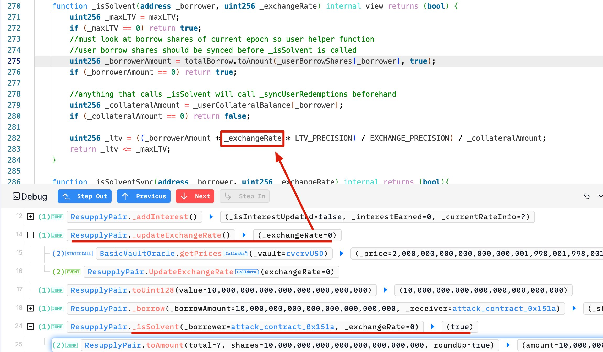
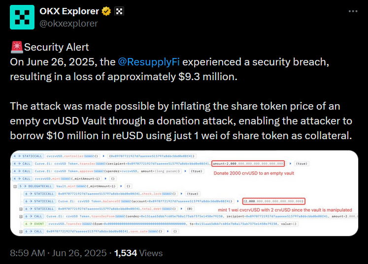
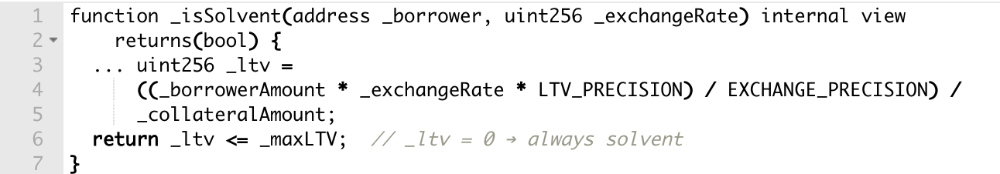

import { Aside } from 'astro-pure/user'

**June 25th was meant to be a celebration — a new vault, a new token, a new market. Instead, it became a $9.8 million obituary.**  
A freshly deployed ERC-4626 vault was gutted by a donation attack so textbook it could’ve been cited in a smart contract 101 course.

**The killer? One wei. The weapon? A 2,000 crvUSD “gift.”**  
In minutes, an attacker warped the vault’s math to zero and drained everything — long before the first damage report went out.

ResupplyFi had audits. They had governance.  
**What they didn’t have was a calculator that could survive an empty vault.**

---

##  When Pocket Change Wrecks Protocols

**Excitement filled the air as ResupplyFi deployed their new cvcrvUSD-wstUSR market.** But underneath that excitement lurked the most dangerous vulnerability in ERC-4626 vaults: the empty vault.

By the time [BlockSec Phalcon](https://x.com/Phalcon_xyz/status/1938073001087652021) posted about a $9.8M exploit in progress, it was already too late. Within blocks, the attacker had finished draining the market and vanished into the darkness.

> _"Yet another lending protocol exploited via exchange rate manipulation on low-liquidity—even empty—markets!"_ – BlockSec



---

##  Arithmetic Armageddon: Breaking the Math With 1 Wei

Wanna see how a small donation gave back a multi-million dollar deal?

_ResupplyFi's incident reads like a textbook case study in why empty ERC4626 vaults could be financial suicide machines._

**Step one:** Target a freshly deployed market. The `cvcrvUSD` vault had been live for exactly two hours—barely enough time for the deployment transaction to cool down, let alone accumulate any meaningful liquidity.

**Step two:** Execute the donation attack. The attacker transferred 2,000 `crvUSD` directly to the vault controller, then minted just 1 wei of shares. This created a share price so astronomically inflated it broke ResupplyFi's exchange rate mathematics. ([Technical breakdown by CoinBench here](https://coinsbench.com/from-1-wei-to-10m-reusd-anatomy-of-a-resupplypair-exploit-9e97748fdce1))

**Step three:** Watch the protocol commit financial suicide.  
ResupplyFi calculated exchange rates using the formula `1e36 / oracle.getPrices()`. When the oracle correctly reported the inflated vault price (`2*10^36`), the division rounded down to zero due to floor division.

_Exchange rate equals zero. Loan-to-value ratio equals zero. Borrowing limits? What borrowing limits?_

According to [OKX Explorer](https://x.com/okxexplorer/status/1938077045600489821), the attacker deposited **1 wei** of `cvcrvUSD` as collateral and borrowed **$10 million reUSD**—the protocol’s **entire** available liquidity.



As [Cyvers detailed it in Decrypt’s piece on the exploit](https://decrypt.co/327148/hacker-drained-9-6-million-from-defi-stablecoin-protocol-resupply):

> “The attacker manipulated token prices, triggering a bug (zero exchange rate) in Resupply's smart contract, letting them borrow a ton of money for almost nothing.”

ResupplyFi’s smart contracts had just approved an almost $10 million loan backed by **pocket lint**.

**Sometimes the most devastating attacks are the most predictable ones.**

_How do you trace a crime that leaves every fingerprint on an immutable ledger?_

---

##  From Pocket Change to Protocol Drain


**Act I: The Flash Loan Spark**

- The attacker initiated the exploit by borrowing **$4,000 USDC** from Morpho.
- They swiftly converted it to **4,000 crvUSD**, setting the stage for manipulation.


**Act II: The Phantom Donation**

- A **2,000 crvUSD donation** was sent directly to ResupplyFi’s vault.
- Then, **2 crvUSD** was deposited to mint a tiny **1 wei** of cvcrvUSD shares.
- **Why it mattered:** This single wei now **represented the entire vault balance** thanks to the donation—distorting the internal accounting system.


**Act III: The Math That Broke DeFi**

ResupplyFi's `getPrices()` function returned an astronomical exchange value:  
`2,000,000,000,000,000,001,998,001,998,001,998` for that single wei.

The formula:

```
exchange rate = 1e36 / inflated_value
```

Which meant...

> **Exchange Rate = 0 → Infinite Borrowing Power**


**Act IV: The Bank Heist**

With that **worthless 1 wei**, the attacker borrowed the protocol’s full **10 million reUSD** borrow limit.

- The system didn’t flag insolvency because:
    
> With an exchange rate of zero, the protocol calculated a **zero LTV** (Loan-to-Value) ratio.
    


**Act V: The Vanishing Act**

- The attacker swapped **reUSD for ETH and stablecoins** using Curve and Uniswap.
    
- Funds were **scattered across wallets** and laundered through **Tornado Cash**.
    



---

### Why Empty Vaults Are Dangerous

Vaults built using ERC-4626 calculate share prices based on token balances. In a healthy vault:

> 1000 tokens → 1000 shares → 1:1 ratio

But in an empty vault, even a small donation can cause chaos:

> 2000 tokens + 1 wei of shares → 1:2,000,000 ratio

This distortion breaks the pricing logic completely, allowing a malicious actor to fake solvency, bypass borrowing limits, and drain funds effortlessly.

> A donation attack distorts this price. When protocols **trust** this value without bounds checking, they’re begging to be exploited.

---

## Crisis Management Classics: The Aftermath

The dust hadn’t even settled before ResupplyFi hit send: $9.8 million gone. They tried to calm nerves—only the wstUSR market was hit, the rest of the protocol worked "as intended." But that did little to soothe a community reeling from a black swan coded into fresh contracts.

Curve's Michael Egorov quickly distanced himself. “No one from Curve worked on this project.” Fair—when the vault implodes, you don’t want bystanders catching shrapnel.

Then, the pivot: repair mode. Insurance kicked in—but quietly. No loud claims, no elaborate coverage disclosures. Just silent movement. And then came the twist no one saw coming: **C2tP**, a prominent Convex dev, dropped \$1.4M of his own funds. Then Convex itself sent \$810K more. With \$600K from the treasury, the rescue hit \$2.8 million. A bleeding wound now partially stitched.

Commendations flooded in. “LP funds were never at risk,” many echoed. “This was above and beyond.” But behind the praise was an uneasy truth: a DeFi protocol got wrecked, and it took a dev’s wallet to bail it out.

Then came the user confusion. Many didn’t know they were in the insurance pool. They hadn’t read the fine print—maybe there wasn’t any. “We joined an insurance pool, not a bailout fund,” one user lamented. But the damage was done, the funds were used, and lessons were learned—too late.

ResupplyFi didn’t collapse. But it didn’t walk away clean either. It walked away patched up—with scars that spoke louder than its code.
    

---

##  Lessons Written in Loss

_ResupplyFi’s exploit is a reminder of what happens when known DeFi bugs meet real money._

**Deploy a vault. Skip key protections. Get hit with a donation attack.** The result? Someone turned loose change into a $9.8 million payday.

On the surface, everything looked polished. Governance proposals passed. Audits cleared. The vault launched.

But beneath it was a known issue: ERC4626 donation attacks. Also called vault inflation or empty-market rounding bugs, these aren’t new — and they’re not rare.

**Still, the vulnerability made it through. And in under two hours, ResupplyFi lost almost $10 million.**

_If well-known exploits can still slip past audits, what does that say about DeFi’s current security model?_

---

## 🧾 TL;DR

- Attacker donated 2,000 crvUSD to an **empty ERC-4626 vault**
- Minted **1 wei** of shares, distorting exchange rate
- Protocol’s math returned **0 exchange rate**
- Borrowed **$10M reUSD**—the entire market
- Washed funds via **Tornado Cash**
- **$2.8M repaid** by devs and treasury
- Core issue: **No protection against donation attacks in empty vaults**
    

---

##  **Final Thoughts: When DeFi Forgets Its Own Playbook**

> **DeFi doesn’t need new attack vectors—it needs better memory.**

ResupplyFi’s downfall wasn’t some zero-day exploit. It was the cost of ignoring well-documented risks.

ERC-4626 donation attacks are nothing new. The defenses are painfully straightforward: **guard empty vaults, cap exchange rate logic, and verify collateral inputs.**

But in a rush to launch, even seasoned teams skip the basics. And when that happens, attackers don’t need cutting-edge techniques—they just need a protocol that forgot its homework.

Until fundamentals become second nature, DeFi will keep relearning the same expensive lesson.

---

💸 DeFi isn’t broken — just forgetful.  
For more post-mortems, real exploit breakdowns, and security rants, follow me on [X](https://x.com/0xquantumloom).
