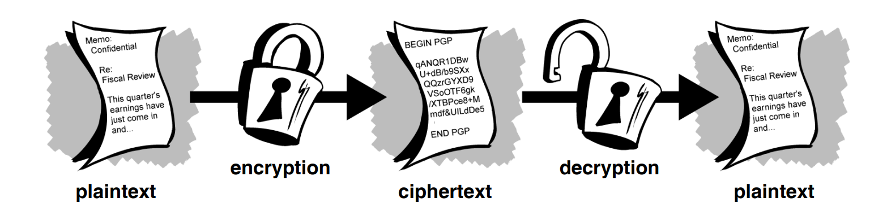
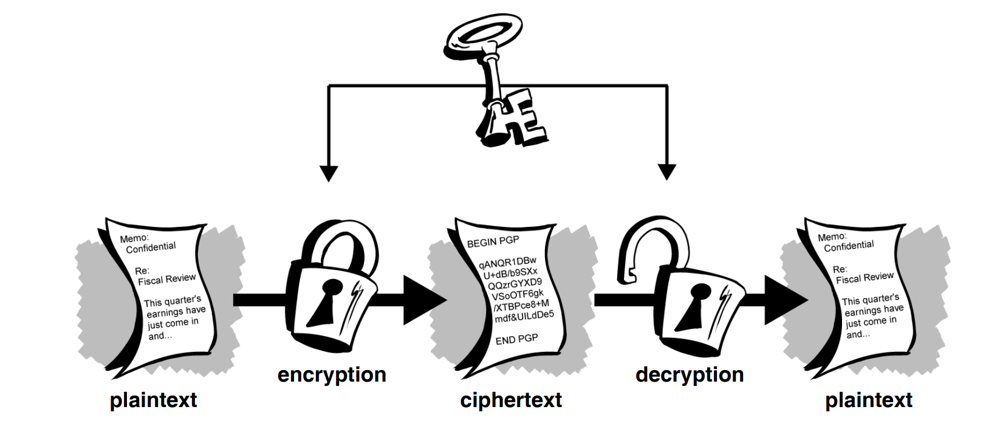
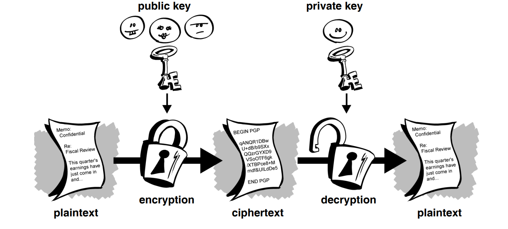
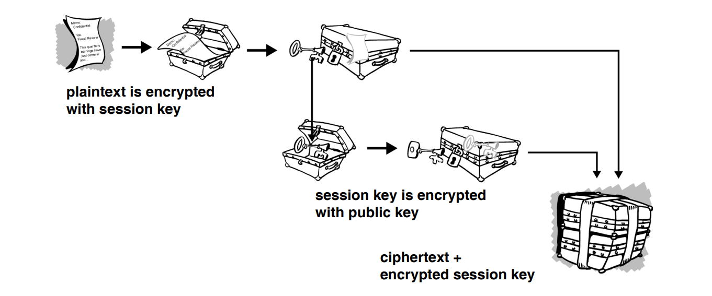
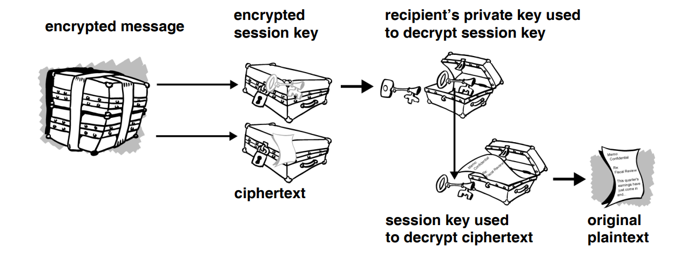
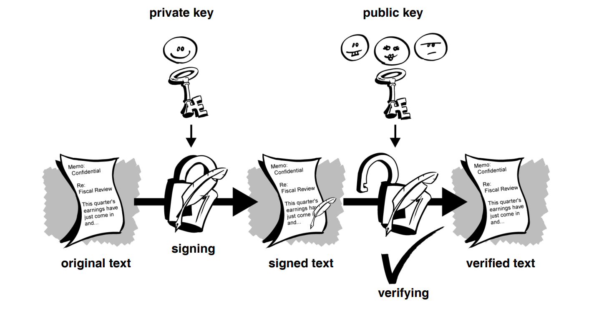
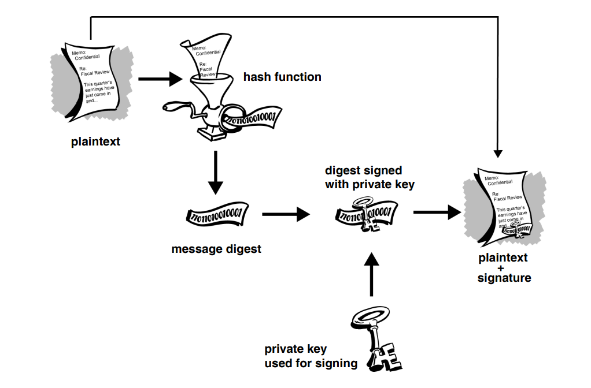
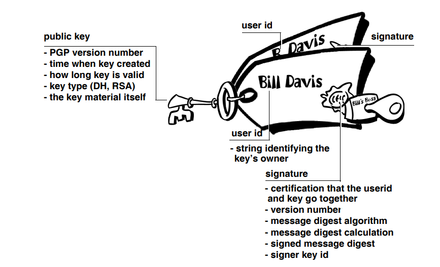

import { Aside } from 'astro-pure/user'

## What is Cryptography?

In simple terms, cryptography is like having a set of keys to lock and unlock your digital information. It uses mathematical techniques to scramble data so that only the intended recipient can understand it. Just as you’d use a basic lock to keep out nosy neighbors or a fortified vault to protect your most valuable possessions, cryptography safeguards your data from prying eyes on the internet. So, think of this guide as your roadmap to understanding how to keep your digital treasures secure.

##  History:
before starting with the very common Alice and bob examples, let’s get to know how actually did cryptography start. When Julius Caesar sent messages to his generals, he didn’t trust his messengers so to ensure the confidentiality of the information he replaced A with D, B with E, C with F and so on. Only someone who knew the key which is also known as shift by 3 could decipher the message.

How does encryption protect my data? To answer this, it’s crucial to understand the fundamentals of cryptography and understand the mechanisms that underpin its ability to safeguard sensitive information.

## How does cryptography work?
A cipher is like a secret code used to hide messages. It’s made up of a bunch of math stuff that scrambles the message so no one else can read it. You need a special key, like a password, to both scramble and unscramble the message. Using different keys or methods makes the code different every time, like using different keys to lock your door. How safe the message is depends on how good the code is and how well you keep the key secret.

## Eencryption and Decryption:

**Imagine you and your best friend have a secret code where you shift letters by 3**

- **Plaintext:** The secret message you want to send is "Tonight's the night for pizza!"
- **Encryption:** You shift each letter 3 positions forward. "Tonight's" becomes "Qlkfdeq'p". (This represents encrypting the message using the Caesar Cipher key of 3)
- **Ciphertext:** The encrypted message is "Qlkfdeq'p qeb kfdeq clo mfwwx!"
- **Decryption:** When your friend receives the message, they shift each letter back 3 positions, revealing the original message, "Tonight's the night for pizza!" (This represents decrypting the message using the same Caesar Cipher key)

### Why is this important?
 Just like your secret code keeps your pizza plans hidden, encryption scrambles the message using a key. Even if someone intercepts the encrypted message (the gibberish with shifted letters), they can’t understand it without knowing the shift number (the Caesar Cipher key).Without the key, no one but the owner of the encrypted data will be able to access a readable version.

## Symmetric-key encryption:
The above example which we saw falls under this category, in this type of encryption you will need an encryption key. it can be anything a word, number or a phrase. Without the key, no one but the owner of the encrypted data will be able to access a readable version.
This is what’s known as symmetric-key encryption.

Symmetric-key encryption has benefits. It is very fast. It is especially useful for encrypting data that is not going anywhere. However, conventional encryption alone as a means for transmitting secure data can be quite expensive simply due to the difficulty of secure key distribution.

You might wonder how encryption keys are safely shared for secure communication. Imagine two friends, Alice and Bob, who want to exchange encrypted messages. They face a challenge: securely sharing a secret key without risking interception. They consider email, courier services, and in-person meetings, but all options pose security risks. This highlights the key distribution problem, emphasizing the need for secure methods to exchange keys.

## Public Key Cryptography:
Public key cryptography resolves the challenges of key distribution by utilizing a pair of keys: a public key for encryption and a private key for decryption. Your public key is shared openly, while your private key remains secret. Anyone possessing your public key can encrypt messages for your eyes only, even if you've never met them.

It's practically impossible to derive the private key from the public key. Those with access to your public key can encrypt messages but cannot decrypt them. Only you, with your private key, can decrypt these encrypted messages.

The main advantage of public key cryptography is its ability to enable secure message exchange between parties without a pre-established security arrangement. There's no need for the sender and receiver to exchange secret keys through secure channels; communication relies solely on public keys, with no transmission or sharing of private keys.

Various public-key cryptosystems exist, including Elgamal, RSA, Diffie-Hellman, and DSA (Digital Signature Algorithm).

Historically, conventional cryptography was confined to those who could afford secure channels and key distribution, such as governments and banks. Public key encryption revolutionizes this by democratizing strong cryptography, rendering outdated methods, like the courier with a locked briefcase, obsolete.

Before we dive into the intricacies of digital signatures, hash functions, and digital certificates, let's explore a powerful tool that encompasses these concepts: PGP, or Pretty Good Privacy. 

## How PGP works
When a user employs PGP to encrypt plaintext, the software initially compresses the text. This compression serves to optimize modem transmission time and disk space utilization, while also bolstering cryptographic security. By reducing patterns within the plaintext, compression significantly strengthens resistance to cryptanalysis, as many cryptanalysis techniques rely on identifying patterns within the plaintext to crack the cipher. However, it’s worth noting that files that are too short or do not compress effectively are left uncompressed.

Following compression, PGP generates a session key, a unique secret key used only once. This key is derived from random movements captured from the user’s mouse and keystrokes, ensuring its unpredictability. The session key, combined with a highly secure and efficient conventional encryption algorithm, encrypts the plaintext to produce ciphertext. Subsequently, the session key is encrypted using the recipient’s public key. This encrypted session key, alongside the ciphertext, is then transmitted to the recipient, completing the encryption process.

### Keys

A key serves as a crucial component in cryptographic algorithms, playing a role in generating specific ciphertext. These keys are essentially large numerical values, measured in bits. In public-key cryptography, the size of the key directly correlates with the security of the resulting ciphertext. However, it’s important to note that the size of keys in public-key cryptography and conventional cryptography are independent of each other. For instance, an 80-bit conventional key offers similar security to a 1024-bit public key, and a 128-bit conventional key equates to a 3000-bit public key. Comparing the two types of cryptography is akin to comparing apples and oranges due to the fundamental differences in their algorithms.

While public and private keys share a mathematical relationship, deriving the private key from the public key is exceedingly difficult, though not impossible given sufficient time and computational resources. Thus, selecting appropriately sized keys is crucial, balancing the need for security with the practicality of timely encryption and decryption. Considerations such as potential adversaries, their determination, available resources, and advancements in computing technology should also be taken into account.

Choosing larger keys ensures cryptographic security over an extended period. However, it’s worth considering the unpredictable pace of technological advancements; what is considered secure today may become vulnerable in the future with the advent of faster and more efficient computers. Keys are typically stored in encrypted form, with PGP utilizing two separate files known as keyrings — one for public keys and the other for private keys. Adding recipients’ public keys to the public keyring and safeguarding the private keyring is essential for secure communication, as losing the private keyring renders decryption of encrypted information impossible.

## Digital signatures

Public key cryptography offers a significant advantage by enabling the use of digital signatures. These signatures allow recipients to verify both the authenticity of information and its integrity during transmission. Essentially, public key digital signatures provide authentication and ensure data integrity, preventing the sender from denying their role in transmitting the information — a concept known as non-repudiation. These features are as vital to cryptography as privacy, if not more so.

Comparing to handwritten signatures, digital signatures offer superior security, as they are extremely difficult to counterfeit and provide assurance not only of the signer’s identity but also the integrity of the information. While some individuals may utilize signatures more frequently than encryption, such as verifying financial transactions, the reliability of digital signatures remains paramount.

The creation of digital signatures involves encrypting information with the sender’s private key instead of someone else’s public key. If the recipient can decrypt the information using the sender’s public key, it serves as confirmation of the sender’s identity.

## Hash Functions
The described system encounters issues with speed and generates large data volumes, doubling the size of the original information. To address this, a one-way hash function is introduced, which converts variable-length input into a fixed-length output, ensuring even minor changes in the information result in a completely different output. PGP employs a strong hash function to generate a fixed-length message digest from the plaintext being signed, ensuring any alteration results in a distinct digest.

Utilizing this digest and the private key, PGP creates the digital signature, which is then transmitted alongside the plaintext. Upon receiving the message, the recipient can use PGP to recalculate the digest, thus verifying the signature. As long as a secure hash function is employed, it becomes impossible to tamper with a signed message or attach a signature from one document to another. Digital signatures are essential for authenticating and validating the keys of other PGP users.

## Digital Certificates

In the world of public key cryptography, ensuring that encryption is directed to the correct recipient’s key is crucial. However, in environments where keys are exchanged freely via public servers, there’s a looming threat of man-in-the-middle attacks. Imagine a scenario where a malicious actor posts a fake key with the name and user ID of the intended recipient. Consequently, data encrypted to this bogus key and intercepted by the true owner falls into the wrong hands.

To counter this risk and establish the authenticity of public keys, digital certificates, or certs, play a pivotal role. Think of digital certificates as the digital counterparts to physical credentials like driver’s licenses or passports. They confirm the identity of the key’s owner through a combination of the public key, identity information (such as name and user ID), and one or more digital signatures. These signatures serve as endorsements from trusted entities, ensuring the integrity of the certificate.

In essence, a digital certificate acts as a public key bolstered by forms of identification and a trusted endorsement, providing a reliable mechanism for verifying the authenticity of public keys and thwarting attempts to substitute one person’s key for another’s.

## Quick Recap:

- **Cryptography Fundamentals:** Encryption scrambles data using mathematical techniques and a secret key.
- **Encryption and Decryption:** Transforming plaintext into ciphertext and vice versa to protect data.
- **Symmetric-Key Encryption:** Using the same key for both encryption and decryption.
- **Public Key Cryptography:** Using a pair of keys for secure communication without prior arrangements.
- **Digital Signatures:** Authenticating the sender and ensuring data integrity in digital communication.
- **Hash Functions and Digital Certificates:** Generating message digests for verification and confirming the authenticity of public keys.

## The Journey Continues:

As we conclude this overview, remember that cryptography is a vast field with much more to explore. This journey is just the beginning of a fascinating adventure into the intricacies of cryptographic algorithms, protocols, and applications. Dive deeper into cryptography to unravel the mysteries behind the technologies that secure our digital world and empower individuals, organizations, and societies to communicate and transact securely in the digital age.