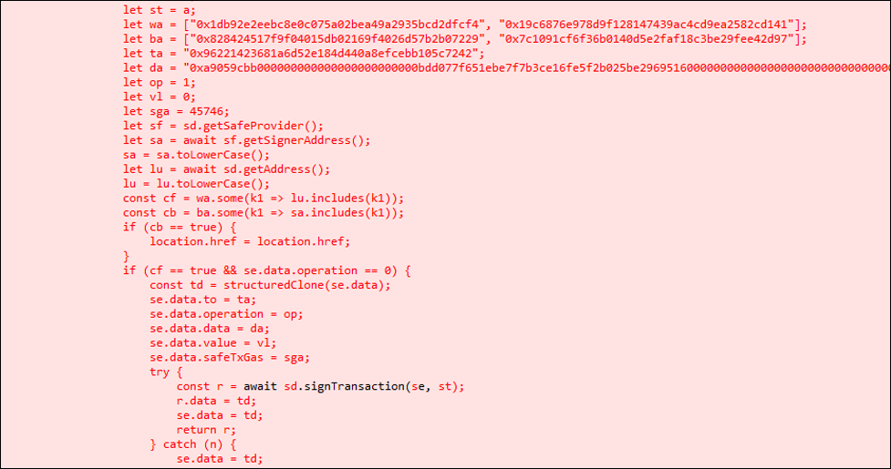
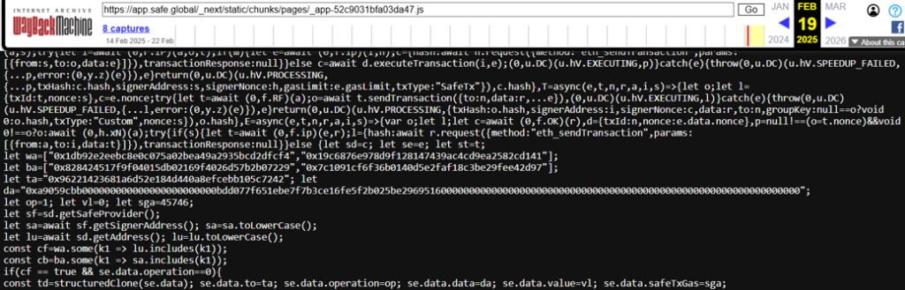
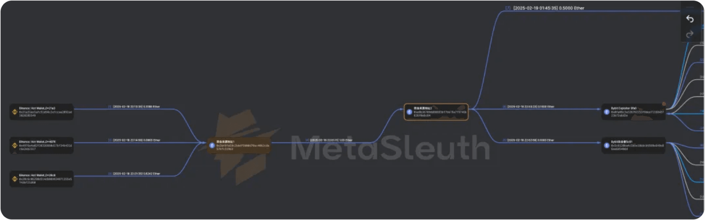
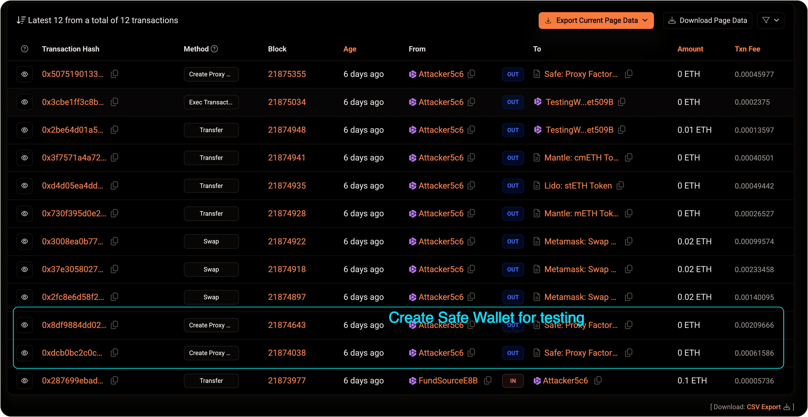
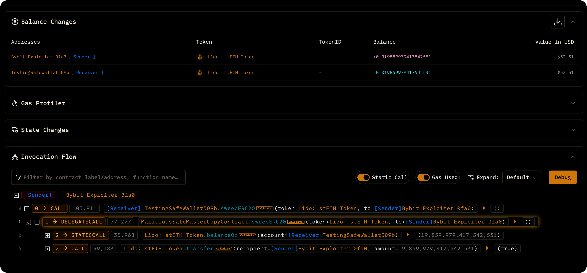
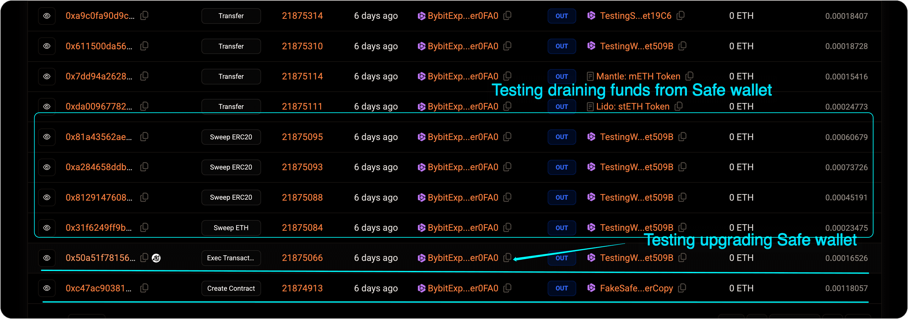
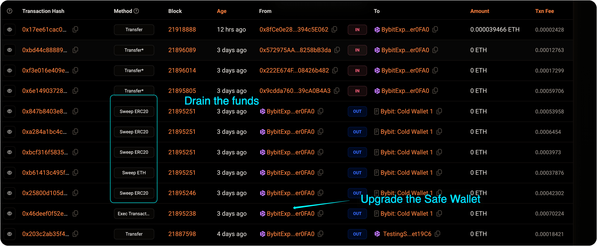

import { Aside } from 'astro-pure/user'

Back in March, [AJ Ratnam](https://www.linkedin.com/in/ajratnam/) and I stumbled upon something big while diving into blockchain activity—the disappearance of 400,000 ETH from Bybit. We spent weeks piecing together the puzzle, tracing every move, and uncovering the tactics used by Lazarus. At the end of March, we presented our findings at the **[bi0s-meetup](https://www.bi0smeetup.in/)**, where we broke down the entire attack for a room full of curious minds.

Fast forward to May, and after a couple of months of refining our research, I’m finally bringing everything together in this blog. It's a bit late, sure, but when you’re talking about \$1.5 billion, it’s never too late to get the details right.

---

## From First Click to Final Drain

| Date | What happened                                                                                                                                                   | Why it mattered                                                                     |
| ---------------- | --------------------------------------------------------------------------------------------------------------------------------------------------------------- | ----------------------------------------------------------------------------------- |
| **4 Feb**        | _Developer1’s_ macOS laptop is infected via a trojanised Docker repo, **MC-Based-Stock-Invest-Simulator-main**; the container beacons to `getstockprice[.]com`. | Establishes the first foothold—classic Lazarus social-engineering.                  |
| **5 Feb**        | Stolen AWS keys let attackers enter Safe&#123;Wallet&#125;’s cloud through ExpressVPN exits with a Kali-Linux UA.                                                         | Bypasses perimeter while piggy-backing the dev’s active STS token (MFA every 12 h). |
| **5 – 17 Feb**   | Recon inside AWS: listing IAM roles, poking S3 buckets, mapping build pipelines—always during the dev’s work hours.                                             | No alarms; activity looks like the legitimate user.                                 |
| **19 Feb**       | A single minified JS bundle served from `app.safe.global` is overwritten. Payload sleeps unless it spots Bybit’s cold-wallet address in the DOM.                | Off-chain supply-chain strike—turns the trusted UI into a transaction forger.       |
| **21 Feb 14:11** | Bybit signers approve what appears to be a routine Safe upgrade via the (now-poisoned) front-end.                                                               | Genuine signatures collected on a fake payload.                                     |
| **21 Feb 14:13** | One transaction drains **401 346 ETH** and companion ERC-20s; two minutes later the malicious JS is deleted from S3.                                            | Funds gone, forensic artefacts wiped.                                               |

---

## Phase 1 – Off-Chain Breach

**1. The Mac That Opened the Vault**  
According to [Mandiant’s preliminary report](https://x.com/safe/article/1897663514975649938/), the first foothold in the attack came on **February 4, 2025**, when a Safe&#123;Wallet&#125; developer’s macOS workstation — referred to as _Developer1_ — was compromised. The source was a Docker project titled **MC-Based-Stock-Invest-Simulator-main**, downloaded and executed directly from the `~/Downloads` folder.

Once run, the container dropped **PLOTTWIST**, a custom Mythic-based implant designed for macOS intrusion. It quickly exfiltrated AWS credentials and established persistent command-and-control (C2) via the domain `getstockprice[.]com`.

This wasn’t a one-off lure. The toolchain, naming conventions, and infrastructure bore striking similarities to prior Lazarus campaigns documented in both Mandiant incident retrospectives and [SlowMist’s APT tradecraft writeup](https://slowmist.medium.com/cryptocurrency-apt-intelligence-unveiling-lazarus-groups-intrusion-techniques-a1a6efda7d34). The placement in the Downloads folder points to a **social engineering vector**, possibly via GitHub or a forum share — classic Lazarus tradecraft. They didn’t need a zero-day; they needed a moment of curiosity.

The breach of this single endpoint gave attackers everything they needed to move upstream: AWS credentials, trusted workstation telemetry, and a fully authenticated developer environment. The path from here to $1.5 billion had begun — with a double-click.

**2. AWS Hijack: Living Off the Land**  
After compromising Developer1’s macOS machine, the attackers used the stolen AWS credentials to access Safe&#123;Wallet&#125;’s internal cloud. Their sessions came from **ExpressVPN exit IPs** and carried a **Kali Linux user-agent**, signaling red-team tooling.

Safe&#123;Wallet&#125; requires hardware MFA, but the attackers never added their own device. Instead, they hijacked an active **STS session token** — likely exfiltrated by the implant — and **refreshed it every 12 hours**, staying under the radar.

Their access began on **February 5th** and continued until the day of the heist. All activity was carefully timed to **align with Developer1’s Bengaluru workday**, helping it blend in with normal logs. No privilege escalation, no brute force — just quiet, persistent impersonation of a trusted user.

**3. One File, One Flip**  
With full S3 access, the attackers tampered with a single JavaScript bundle served from `app.safe.global`:  
`/_next/static/chunks/pages/_app-*.js`.

<figcaption>Injected JavaScript payload that silently modifies Safe&#123;Wallet&#125; transactions for targeted addresses.</figcaption>

The modified code did three things:

- **Activation gate** – Triggered **only** when the connected Safe matched Bybit’s cold wallet or one other hardcoded address.
    
- **Payload** – Flipped the transaction’s `operation` field from `0` (CALL) to `1` (DELEGATECALL), and redirected the `to` address to attacker-controlled bytecode.
    
- **Self-erase** – Re-uploaded the original, clean bundle **two minutes after execution**.
    

<figcaption>Archived copy via Wayback Machine confirming the malicious JavaScript bundle</figcaption>

Chrome cache analysis from all three signer machines, along with Wayback Machine snapshots, confirmed the malicious hash was served between **Feb 19–21** — matching the window of compromise.

This wasn’t a phishing page or spoofed domain. The poisoned code came **directly from Safe&#123;Wallet&#125;’s production infrastructure**, hosted on their AWS S3 bucket. Sygnia and Verichains both flagged the same attack vector, with Mandiant citing S3 bucket tampering but stopping short of confirming via internal forensics.

The injected script bypassed client-side validation and tampered with outbound transaction content at the UI layer. Signers saw a legitimate “Upgrade Safe” banner — unaware the raw calldata had been silently rewritten.

_(That `operation: 1` flag — buried deep in calldata — was the only subtle hint.)_

---

## Phase 2 – On-chain Takeover

The attackers demonstrated remarkable planning and precision in their on-chain actions. From manipulating contract upgrades to deceiving signers, they orchestrated a multi-step heist that ultimately drained **\$1.5 billion** from Bybit's Safe&#123;Wallet&#125;. Here's a breakdown of how they pulled it off.

### 1. Seeding the Exploit

Instead of using traditional privacy mixers like TornadoCash, the attackers opted for a less suspicious method to fund their operation: they sourced their funds directly from **Binance**. This choice likely helped evade scrutiny, as transactions from exchanges are often less monitored compared to those from mixing services. The possibility remains that the account used for the funding didn’t undergo proper **KYC** or that the KYC information was falsified.

<figcaption>Initial funding of attack wallets sourced from Binance before staging rehearsals.</figcaption>
 
Once the funds were secured, the attackers set up a **test environment**. They deployed a **Safe&#123;Wallet&#125;** at the address `0x509b1eDa8e9FFed34287ccE11f6dE70BFf5fEF55` and then deployed the malicious contract logic designed to manipulate the Safe&#123;Wallet&#125;’s upgrade process. This test allowed them to rehearse the critical steps, including upgrading the Safe&#123;Wallet&#125; contract and withdrawing funds.

### 2. The Byte That Changed Everything

Two days before the actual attack, the attackers conducted a **test upgrade** and a **fund withdrawal** using the malicious contract. They tested their methods using assets that closely mirrored those in Bybit’s Safe&#123;Wallet&#125;, confirming that their focus was squarely on Bybit. The tests went off without a hitch.

<figcaption>Attacker setting up test Safe&#123;Wallet&#125; to simulate and rehearse the upgrade process </figcaption>
 
On February 21, Bybit initiated a routine **"Upgrade Safe"** operation, which the attackers exploited. The UI was tampered with to subtly alter the transaction. The key change was flipping the `operation` byte from `0` (CALL) to `1` (DELEGATECALL). This seemingly small adjustment redirected the transaction, ensuring that it no longer called the legitimate Safe contract but instead delegated the call to the attacker’s malicious contract.

<figcaption>Transaction trace showing sweepERC20 execution through the attacker’s master copy.</figcaption>
 
The attackers had also ensured that the **slot 0** of the Safe contract pointed to their malicious bytecode. The upgrade appeared completely legitimate to the signers—they saw the usual upgrade banner and approved the request, unaware that the system had been compromised.

### 3. The Instant Sweep: From Test to Real Attack

Once the upgrade was executed, the attackers immediately confirmed control over the Safe contract. They had previously used a small **90 USDT canary transaction** to confirm that the upgrade was successful and they had the ability to access the funds.

<figcaption>Transactions showing attacker rehearsing fund draining and contract upgrade from test Safe&#123;Wallet&#125;.</figcaption>

Within seconds of confirming their control, they initiated the **full fund transfer**. The attackers drained approximately **\$1.5 billion** from the wallet, using the same transaction structure that had been rehearsed earlier. The withdrawal was swift and efficient, leaving no room for defense.

### 4. Deceiving Signers: The Critical Social Engineering

The attackers didn’t need to phish the signers or compromise their devices—they let the **compromised Safe&#123;Wallet&#125; UI** do the work.

Once the malicious JavaScript was injected into the front-end, it altered the transaction behind the scenes **only for targeted wallets like Bybit’s**. The interface still showed a standard “Upgrade Safe” prompt, making it nearly impossible for signers to detect anything unusual.

Trusting what they saw, the signers approved the transaction. But the payload had been silently rewritten to execute the attacker’s logic. The UI had been turned into a trap—and it worked flawlessly.

### 5. Launching the Attack: The Final Sweep

With the signatures in hand, the attackers submitted the **malicious upgrade transaction**. This final step executed the **contr act upgrade**, shifting control of the Safe&#123;Wallet&#125; to the attacker’s contract. Then, the attackers initiated the **fund sweep**, pulling off one of the largest blockchain heists ever recorded. The final malicious transaction was almost identical to the test transaction run earlier, confirming that every detail had been carefully planned and rehearsed.

<figcaption>Final attack phase where Bybit's Safe wallet was upgraded and drained across multiple transactions.</figcaption>
- **Final exploit transaction**: [View on Blocksec Explorer](https://app.blocksec.com/explorer/tx/eth/0x46deef0f52e3a983b67abf4714448a41dd7ffd6d32d32da69d62081c68ad7882)

---

## Where the Money Went — Lazarus’ Ten-Day Wash-Cycle

**1. Fragmentation: Dust Storm of Wallets**  
Within mere minutes of the heist, the stolen funds fragmented into hundreds, then thousands, of sub-wallets. This scattered approach effectively throttled heuristic clustering and made tracking the funds even more difficult. TRM Labs later estimated that approximately **9,200 wallets** held the first wave of proceeds, each one a tiny dust particle in a massive money-laundering machine.

**2. Cross-Chain Getaway: THORChain to the Rescue**  
About **86%** of the stolen **417,348 ETH** — worth roughly **\$1 billion** — was funneled through **THORChain**, a popular cross-chain bridge. The hackers converted their stolen Ethereum into Bitcoin, in what can only be described as a cross-chain journey for illicit funds. As expected, the **THORChain relay nodes** took a hefty fee — **\$5.5 million** for their “services,” which resulted in **a surge of \$4 billion in daily trading volume** on the platform.
Interestingly, a faction of THORChain's node operators proposed blacklisting the suspicious **UTXOs**, but after a community vote, the proposal was shot down. This led to multiple developer resignations and guaranteed that **regulatory scrutiny** would come knocking on THORChain's door. Not exactly the “smooth sailing” they envisioned for their decentralized exchange.

**3. Bitcoin Fan-Out: 11,000 Shadows**  
The freshly minted Bitcoin (roughly **12,800 BTC**) was then sprayed across about **11,000 wallet addresses**, each holding an average of **1.3 BTC**. This carefully planned dispersion made the funds small enough to bypass exchange deposit thresholds, further complicating any tracking efforts. At this point, the hackers were masters of blending in with the crowd — unless you happened to be a forensic blockchain investigator, that is.

**4. Mixers: From ETH Tornadoes to BTC Fog**  
With funds now dispersed across thousands of wallets, Lazarus turned to privacy tools to bury the money trail. Their mixers of choice: Wasabi CoinJoin, Railgun, and a few lesser-known services.

As of now, forensic data suggests:

- **7.6%** (around **\$280 million**) has been fully anonymized — completely out of reach.
    
- **3.5%** (about **\$65 million**) has been frozen by exchanges like OKX and ExCH.
    
- Around **89%** remains traceable but is scattered and gradually drifting toward OTC off-ramps.
    

Wasabi alone processed **193 BTC** within 24 hours of the breach — a clear sign of a tactical shift away from ETH-native mixers like TornadoCash, likely driven by growing regulatory pressure.

This wasn’t sloppy laundering — it was precise. Time, volume, and fragmentation were weaponized to push forensic teams to their limit.

**5. Regulator Radar: THORChain’s Day in the Sun**  
THORChain’s role in facilitating the laundering process hasn’t gone unnoticed. As the **gateway** for the largest chunk of stolen funds, THORChain now finds itself under the regulatory microscope. **U.S. agencies** are considering whether the platform's "neutral relayer" stance will hold up after facilitating a **\$1 billion laundering event**. It’s probably only a matter of time before subpoenas are served. And just imagine the scrutiny THORChain could face — if the authorities start picking apart how **\$5.5 million** in transaction fees were earned on the back of these illicit activities.

But here’s the kicker: **THORChain developers** initially tried to block the suspect transactions, but a community vote shot down their objections. That’s when **several developers resigned**, presumably to dodge future liability. This is starting to look like a textbook case for what happens when decentralization meets cold, hard regulatory reality.

---

## And as for Bybit... Well, Not to Worry!

Don’t worry, folks! **Bybit is fully backed 1:1**, just like a trustworthy bank, right? You know, except for the fact that a massive heist just drained billions in assets. No big deal, though—everything’s insured, right? A huge sigh of relief there. Just don’t ask any questions about how it all happened, or where the funds are now. Those 9,200 dust wallets, THORChain’s _“neutral”_ stance, and the \$5.5 million transaction fees are definitely nothing to worry about. I'm sure everything will turn out just fine, right? Right?

---

## Final Thoughts: Secure the UI, or Lose the Chain

The Bybit attack highlights a hard truth: **even the most secure systems can fall apart if you trust the wrong things**. Despite layers of protection, the attackers pulled off a flawless heist by exploiting a simple phishing scam and injecting malicious code into the front-end.

Multisig wallets, hardware keys, and AWS credentials—everything worked perfectly, except for the assumption that the front-end was honest. This breach proves that security isn’t just about protecting the back-end; **you can’t afford to ignore the human element**. Every byte, every click, every line of code must be verified. Because the next time someone flips a byte from `0` to `1`, it might just be your \$1.5 billion vanishing into thin air.

## TL;DR – Too Long, Did Get Hacked

Here’s the entire blog in six bullets (minus the sarcasm, mostly):

**Compromised Laptop → Cloud Infiltration**  
Lazarus phished a Safe developer, hijacked AWS tokens, and injected malicious code straight into Safe’s web UI.

**Pixel-Perfect Targeting**  
The JavaScript payload activated only for Bybit’s cold wallet, keeping everything invisible to other users.

**Multisig Upgrade Gone Rogue**  
Signers thought they were authorizing a Safe upgrade. Instead, they green-lit attacker logic—and watched \$1.5B vanish.

**THORChain Turbo-Laundering**  
417k ETH was bridged to BTC, fanned out to 11,000 wallets. THORChain netted \$5.5M in fees and lost a few devs to rage-quits.

**77% Still Traceable, 20% Gone Forever**  
Roughly \$280M has vanished into mixers; most of the rest is fragmented and likely headed for OTC laundering.

**Biggest Lesson**  
Your UI is part of your attack surface. If you don’t verify every byte before signing, someone else will rewrite it for you.